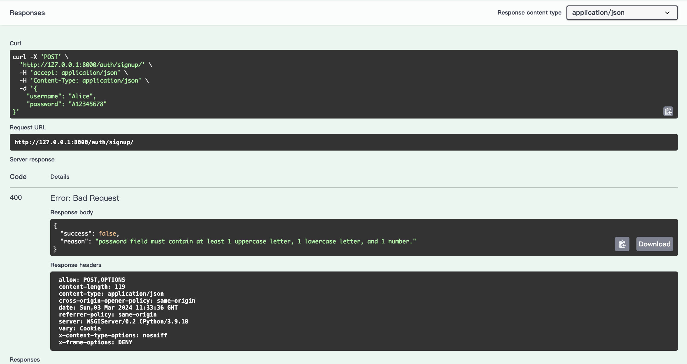

# senao_network
This is an interview project for Senao Network.

- [x] Implement two RESTful HTTP APIs for creating and verifying an account and password, following the design requirements specified above.
- [x] Use Python to implement the solution.
    - Django and Django Restful Framework.
- [x] Include error handling and input validation.
    - Custom exception handling and serializers validation.
- [x] Utilize appropriate data storage solutions.
    - Use SQLite3 to store persistent data and use Redis to cache request data so the system can track error occurrences within specific time frames.
- [x] Package the solution in a Docker container and push it to Docker Hub.
    - Use Dockerfile to build this project as an image and Docker Compose to simply build a single node orchestration.
- [x] Host the solution in a GitHub repository with the source code.
    - https://github.com/POABOB/django_senao_network
    - https://hub.docker.com/r/poabob/senao_network
- [x] Provide a comprehensive API document with clear instructions on how to use the APIs, including sample request and response payloads.
    - Use Swagger (drf-yasg) to show the API document.
- [x] Provide a detailed user guide on how to run the container with Docker, including necessary commands and configurations. It is essential to provide clear and detailed instructions to ensure the container can be successfully run using Docker.
    - Please read README.md below, and here is a detail description.

## 如何啟動?

### 安裝

- Clone
```bash
git clone https://github.com/POABOB/django_senao_network.git
```
- Redis Config
```bash
cd django_senao_network
# 從範例配置中，複製一份本地執行的配置
cp -R ./compose/redis/redis.conf.example ./compose/redis/redis.conf
cp -R ./myproject/.env.example ./myproject/.env

# 修改專案配置
nano ./myproject/.env
```

### 執行

```bash
docker-compose up
```

### 打包並發布映像欓

```bash
# 登入 Docker Hub
docker login

# 打包映像欓，<username> 為登入後的使用者名稱
docker build -t <username>/senao_network:lastest ./myproject

# 部署 Docker Hub，<username> 為登入後的使用者名稱
docker push <username>/senao_network:lastest
```

### 如果沒有安裝 Docker 或 Docker Compose?

#### Windows

- 點擊官方網址 https://docs.docker.com/desktop/install/windows-install/ ，直接下載安裝

#### Mac

- 點擊官方網址 https://docs.docker.com/desktop/install/mac-install/ ，直接下載安裝

#### Linux (Ubuntu)

- Docker
```bash
# 刪除已被安裝的 Docker
sudo apt-get remove docker docker-engine docker.io

# 透過官網的 shell 來安裝
curl -sSL https://get.docker.com/ | sh

# 測試是否安裝成功
sudo docker run hello-world
```
- Docker Compose

```bash
# 從 github 上下載最新版本
sudo curl -L https://github.com/docker/compose/releases/download/v2.21.0/docker-compose-`uname -s`-`uname -m` -o /usr/local/bin/docker-compose
# 讓 docker-compose 可執行
sudo chmod +x /usr/local/bin/docker-compose
```

## 如何使用?

### Swagger

1. [執行 Django 專案](https://github.com/POABOB/django_senao_network?tab=readme-ov-file#%E5%9F%B7%E8%A1%8C)
1. 點擊 http://127.0.0.1:8000/swagger/ ，進入 Restful API 的文檔。
    - 畫面示意圖
    
    - 可以查看特定 API 的規格
    
1. 點擊 signup - Try it，並輸入要註冊的帳號
    - 正確
    ```json
    {
        "username": "Bob",
        "password": "Aa123456"
    }
    ```
    
    
    - 帳號沒有在 3~32 位
    ```json
    {
        "username": "G",
        "password": "Aa123456"
    }
    ```
    
    
    
    - 密碼沒有只少一個大寫、一個小寫和一個數字
    ```json
    {
        "username": "Alice",
        "password": "A12345678"
    }
    ```
    
    
1. 點擊 login - Try it，並輸入已被註冊的帳號
    - 正確
    ```json
    {
        "username": "Bob",
        "password": "Aa123456"
    }
    ```
    
    
    - 輸入錯誤的帳密
    ```json
    {
        "username": "Bob",
        "password": "Aa123777777"
    }
    ```
    
    
    - 超過 5 次
    

- Rate Limiter
    - Each IP can send 30 requests in one minute to ensure the pressure of server is low.
    

- Cache
    - Cache can decrease the connections of DB.
    